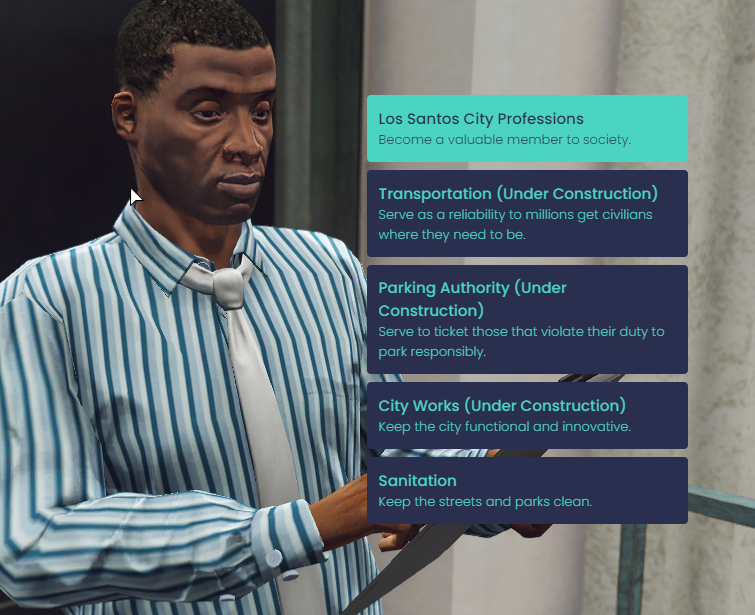

# What's New?

### New Character Selection

Create and manage your characters in this slick new UI with changes to prevent accidental character deletion and smoother transitions to making a new character. Character slots have also increased from <mark style="color:blue;">5 slots to 6 slots available.</mark>

&#x20;<mark style="color:blue;"></mark>&#x20;

<figure><figcaption>
Preview of making a new character
</figcaption></figure>

### New Spawn UI

Choose exactly where you want to spawn in this new visualized format. We've also added a <mark style="color:blue;">bunch of new spawn points</mark> with <mark style="color:blue;">added car rentals</mark> near most spawns. Check it out, the map is custom made.

&#x20;

<figure><figcaption>
Spawn UI
</figcaption></figure>

### New UI Theme

Many UI elements have been updated to give a fresh feeling to the server. Our theme is now a dark blue with a light green hue. There is a <mark style="color:blue;">new third eye target</mark> system in place, it shouldn't change anything on your end aside from theme. You'll notice <mark style="color:blue;">new notifications</mark> and <mark style="color:blue;">new interaction designs</mark>. In addition you'll also notice <mark style="color:blue;">new themed content menus</mark> and <mark style="color:blue;">input menus.</mark>

<figure><figcaption>
New Menu UI
</figcaption></figure>

### New Phone

We got a new phone in our previous business expansion, it didn't meet expectations so now we have an even doper phone, ios based. This phone is still newly developed and more apps will be coming in the near future. <mark style="color:blue;">Contacts will be lost</mark> in this transition, but it's worth it. If you lose focus of the phone while it's open, use left alt to focus back. In addition to this, you will now <mark style="color:blue;">receive periodic messages from the city</mark> just reminding you of various things to do. You can <mark style="color:blue;">disable this feature using /tips.</mark>

<figure><figcaption>
New Phone will city tips text
</figcaption></figure>

### New Public Garages

Garages were reworked, eliminating the old private garages in place of open air public garage spaces to <mark style="color:blue;">park up to 10 cars per garage in</mark>. There is a <mark style="color:blue;">small fee to pay</mark> once you pull your car out however, but you'll receive plenty of notice before and after this happens. Fees only occur once and will not stack daily. Your car will remember the spot you park it, you can organize you cars this way in any public space.

<figure><figcaption>
What appears when you pull up to a public space.
</figcaption></figure>

### New Job Center

The city hall you're used to is now the job center, the city hall is now called the state court. Here is where you can choose to work a profession, which unlocks jobs to do related to that type of work.&#x20;

As you work, <mark style="color:blue;">you'll gain experience.</mark> Once you reach a certain level of experience, you can retire that profession and collect a pension on it with an added bonus <mark style="color:blue;">stacking infinitely based on your experience.</mark> You may only work <mark style="color:blue;">one active profession at a time</mark>, but once you <mark style="color:blue;">retire</mark> you can continue to work that profession, and others.

Criminal activity is <mark style="color:blue;">not advised</mark> while working a profession. If you get <mark style="color:blue;">three strikes you are suspended</mark> from working until a <mark style="color:blue;">judge overrides it</mark>. In 1.0, we're launching with the sanitation profession to start.

<figure><figcaption>
Preview of the job center.
</figcaption></figure>

### Updated Gabz

This version contains the last three months of Gabz releases including the gang club houses, vespucci shops, and other maps.&#x20;
